🛍️ Fashion Boutique – E-commerce Demo

A modern, responsive fashion e-commerce web application built with Next.js and TypeScript, allowing users to browse products, manage a cart, and experience a complete checkout flow.

Designed to showcase real-world e-commerce functionality, clean UI/UX design, and modern front-end development practices.

✨ Features

🛒 Shopping Experience

Browse collections and product listings  
Clean, minimal product layouts with images and pricing  
Fully responsive across desktop, tablet, and mobile  

🧺 Cart System

Add and remove items from cart  
Increase and decrease product quantities  
Dynamic pricing updates (subtotal, shipping, total)  
Persistent cart state using React Context API  

💳 Checkout Flow

Complete checkout form (pre-filled for demo usability)  
Select delivery method (standard / express)  
Dynamic order summary updates  
Smooth user journey from cart → checkout → confirmation  

📦 Order Confirmation

Displays placed order details  
Shows purchased items and totals  
Simulates real e-commerce confirmation experience  
Uses session storage to persist order data  

📄 Supporting Pages

FAQ (accordion-style interaction)  
Privacy Policy (professional layout)  
Contact & informational pages  
Clean footer navigation  

🧱 Tech Stack

Frontend  
- Next.js (App Router)  
- React  
- TypeScript  

Styling  
- Tailwind CSS  
- Responsive design (Flexbox & Grid)  

State Management  
- React Context API (Cart & Wishlist)  
- Session Storage (order persistence)  

📦 Installation & Setup

# Clone the repo  
git clone https://github.com/your-username/fashion-boutique.git  

# Navigate into the project  
cd fashion-boutique  

# Install dependencies  
npm install  

# Start development server  
npm run dev  

🛍️ How to Use

Browse Products  
Explore collections from the homepage  
View product details  

Add to Cart  
Add items to your cart  
Adjust quantity or remove items  

Checkout  
Proceed to checkout  
Review order summary  
Place order (demo only)  

Order Confirmation  
View confirmation details  
See purchased items and totals  

🚀 Future Improvements

User authentication & accounts  
Backend integration (database & API)  
Payment integration (Stripe)  
Product filtering & search  
Wishlist persistence  
Admin dashboard  

📸 Screenshots

### Homepage

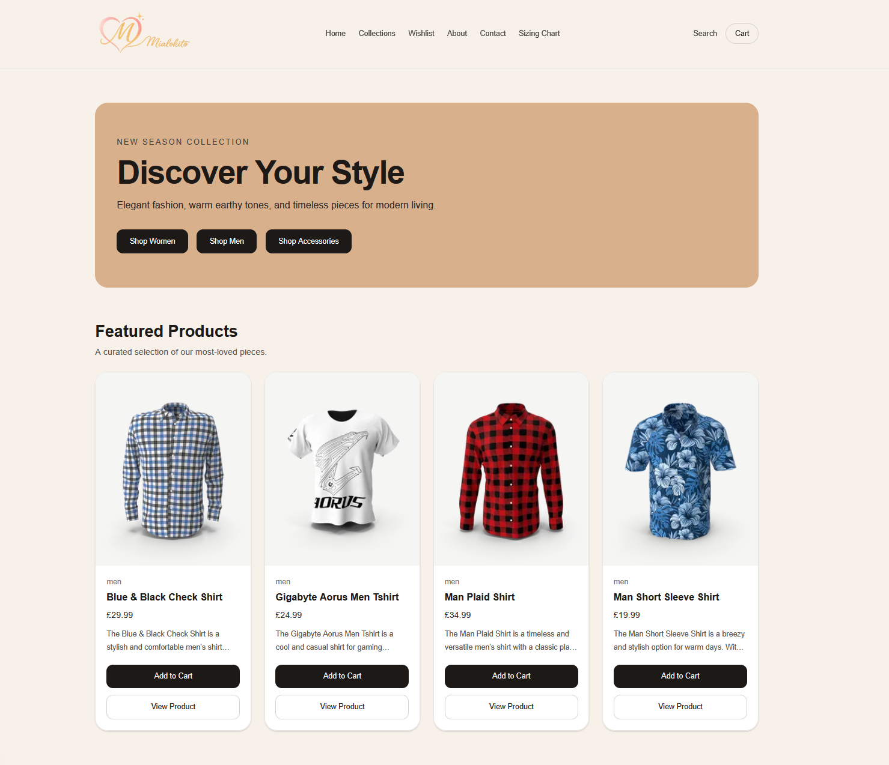

### Collections Page
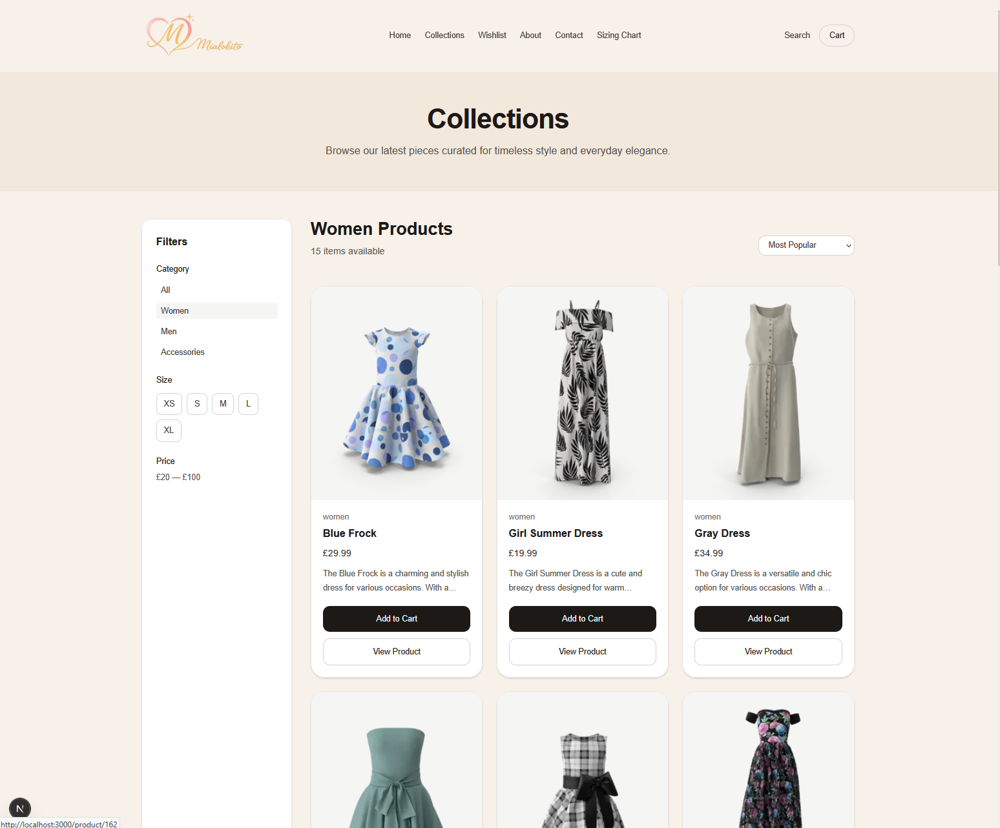

### Product Page
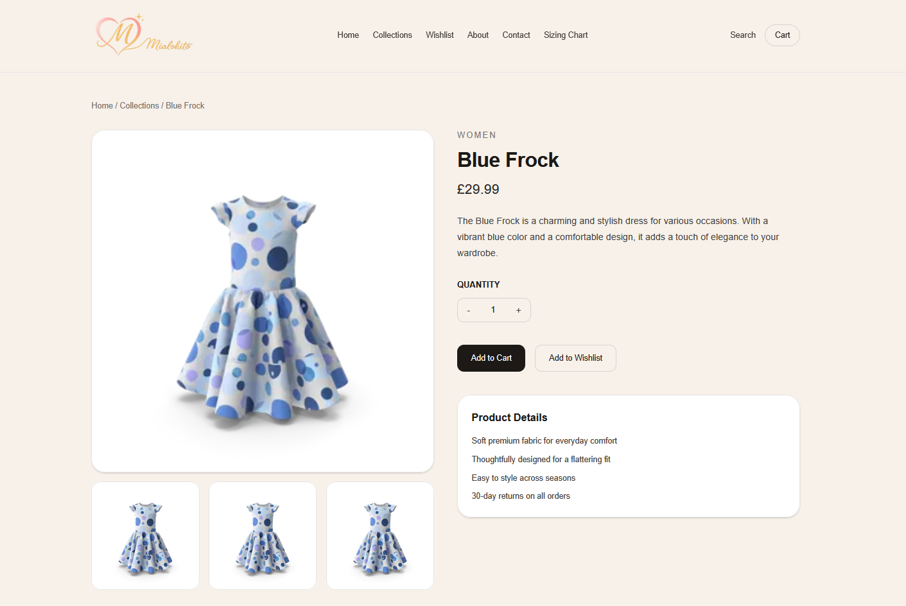

### Wishlist
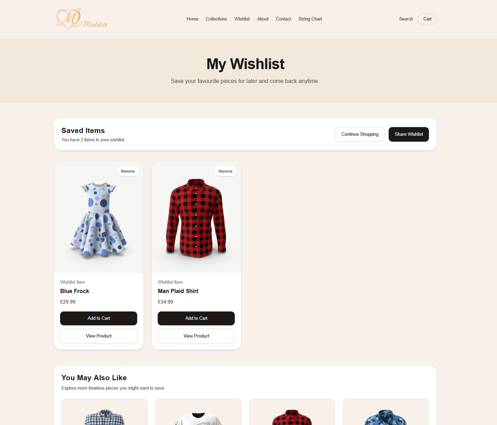

### About Us Page
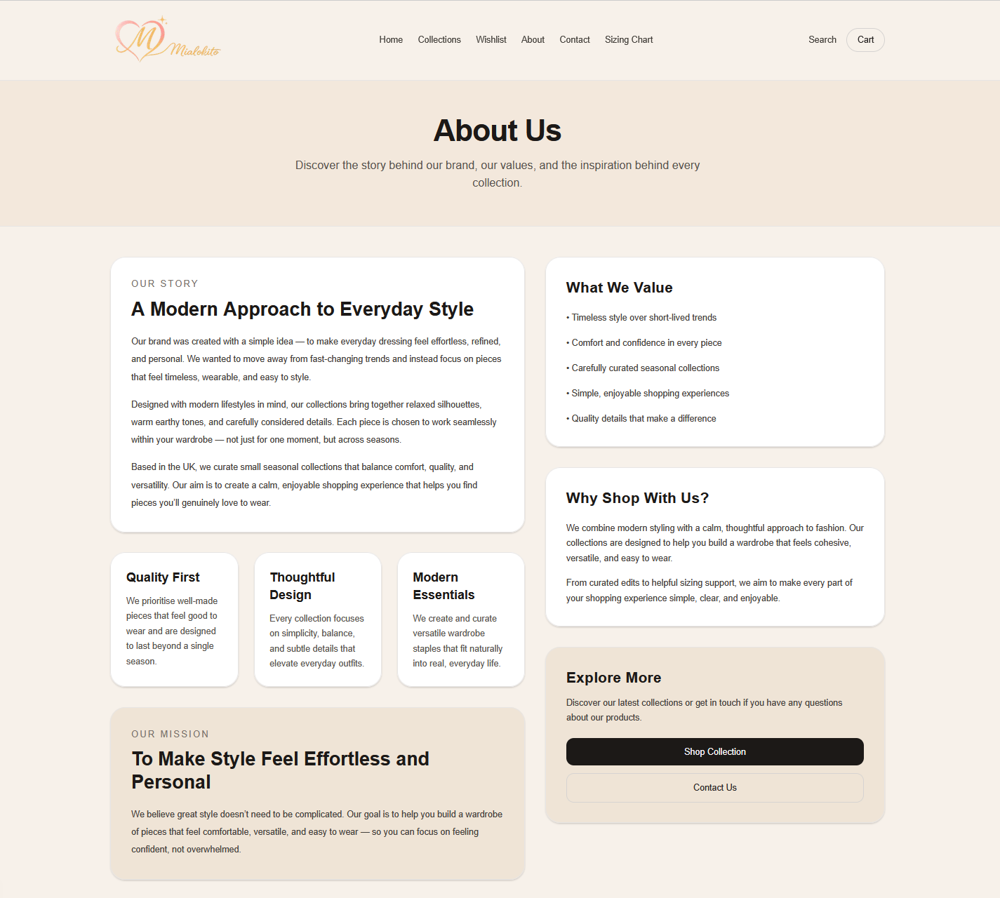

### Contact Us Page
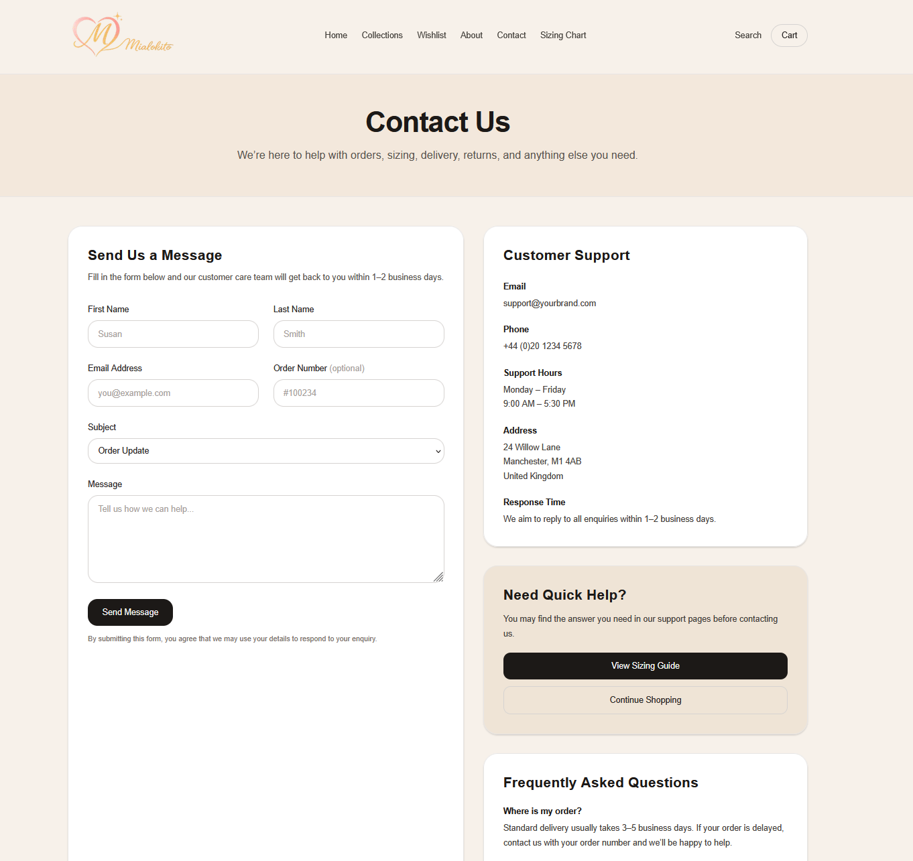

### Sizing Page
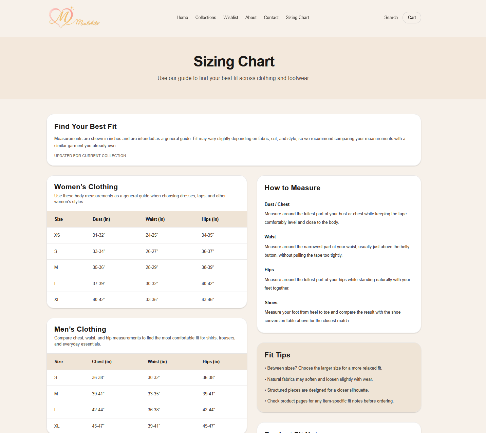

### Search
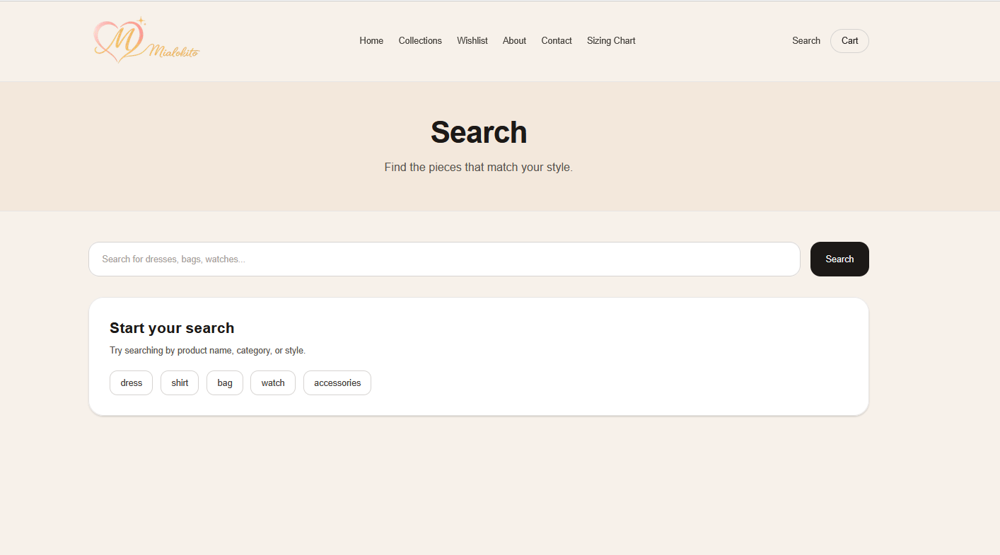

### Cart Page
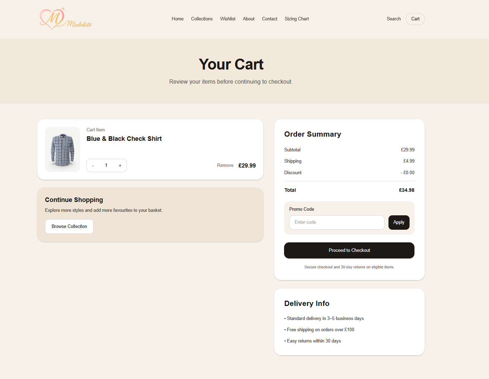

### Checkout
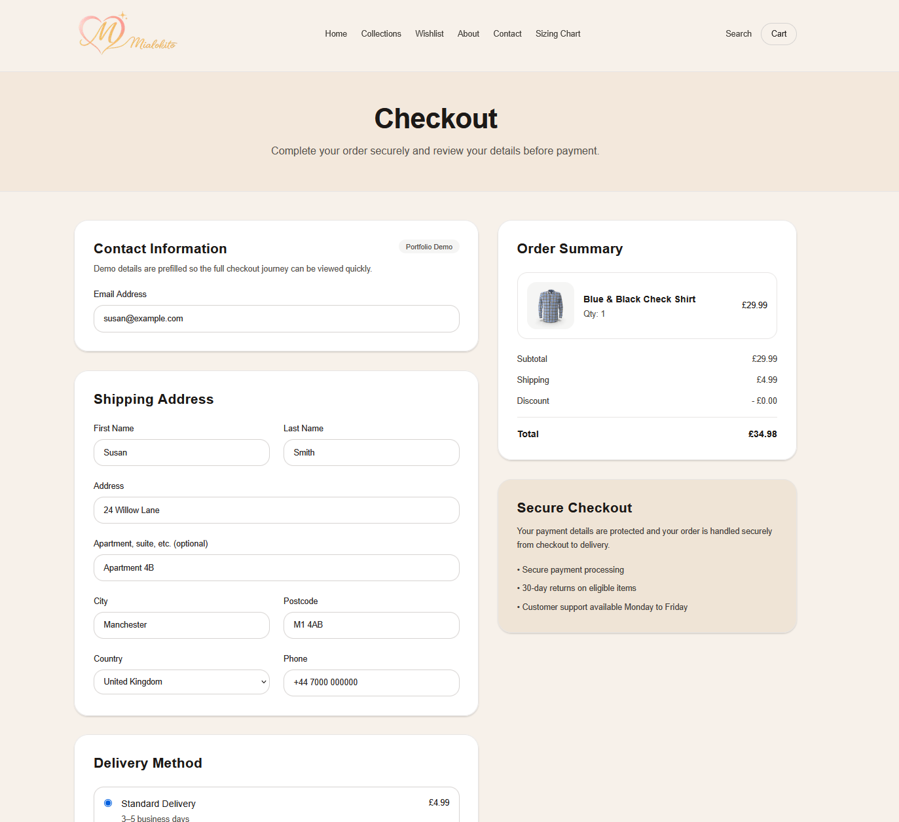

### Confirmation Page
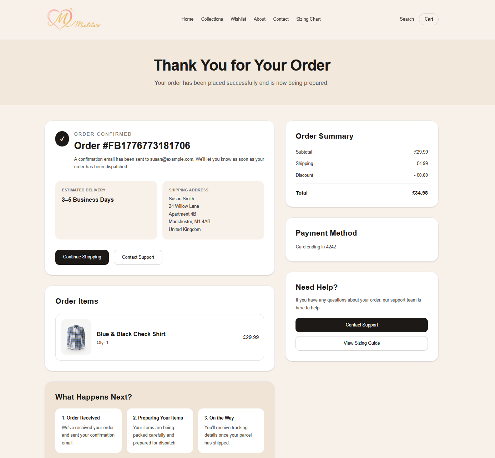

⚠️ Note

This is a portfolio demo project — no real payments or orders are processed.